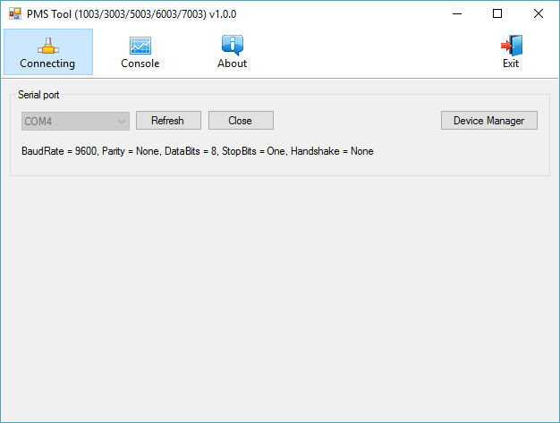
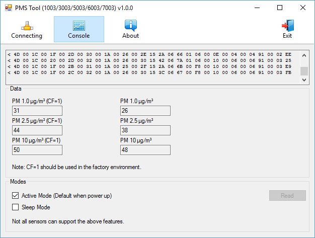

# PMS Tool

C# Windows Forms Application for Plantower PMS sensors.  
Supports PMS x003 sensors (1003, 3003, 5003, 6003, 7003).

## Motivation

I have not found another tool for Windows to test Plantower PMS dust sensors, so I created and share this program.

## Screenshots

## Arduino library
Finally, I made a library for the Arduino:  
https://github.com/fu-hsi/PMS